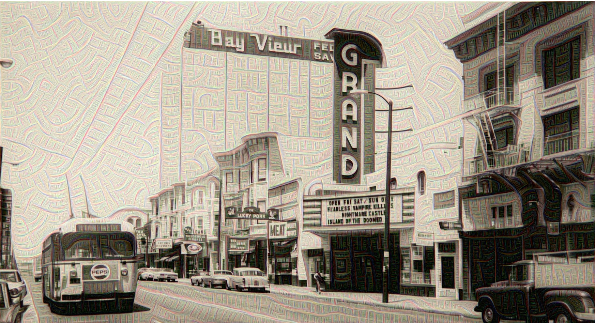

# Gray Area DeepDream

This repository is a copy of the original [deepdream](https://github.com/google/deepdream) repository with new images and new [#deepdream](https://twitter.com/hashtag/deepdream) creations.  It was created for the [Gray Area Festival's DeepDream workshop](http://grayareafestival.io/workshops/) in April, 2016.  

Slides accompanying this workshop are available in [pdf](http://tinyurl.com/grayarea-deepdream-pdf) (no video clips) and [keynote](http://tinyurl.com/grayarea-deepdream-key) format (includes video clips).  

- To set up your machine to be able to run the "dream.ipynb" file located in this repository, visit [this page](https://github.com/WiMLDS/deepdream-workshop) for step-by-step instructions. Currently, the instructions are Mac OS X only.
- Once you have installed all the required software on your machine, you will be directed to start up the IPython/Jupyter notebook server and begin to execute the code in the "dream.ipynb" file.  You can execute the [original deepdream notebook](https://github.com/google/deepdream) or the "dream.ipynb" notebook included in this repository.  
- To do so, you can git clone this repo, or if you have a GitHub account, you can fork this repo.  If you don't have git installed on your machine, you can [download the repo](https://github.com/ledell/grayarea-deepdream/archive/master.zip) as a zip file.
- To make your own creations, you can edit the code to use your own images, or extend the code to explore different layers of the neural net. 

